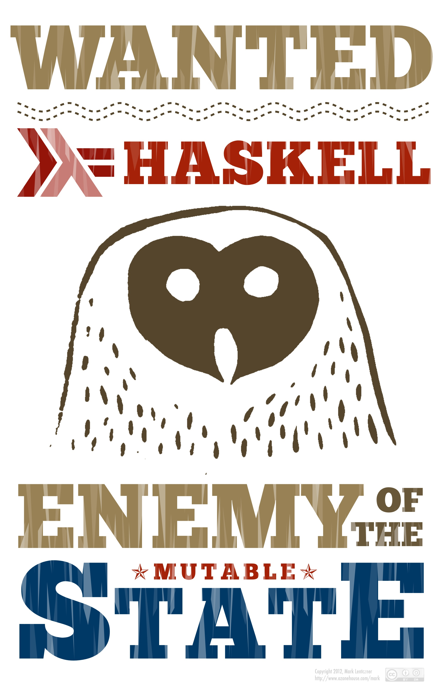

# Intro til Haskell

---

# Hvem er vi?


- Meetup-gruppe her i Oslo
- Åpen for alle som er interesserte i Haskell
- Mini-kurs og foredrag om Haskell og relatert teknologi

---

# Agenda

1. «Lær Haskell på 45 minutter»
2. Koding på oppgaver
3. Oppsummering

---

# Preludium

---

# Haskell

Så... Hva er greia‽

- Hvorfor snakker masse folk på HN/reddit/lobste.rs om et språk «ingen» bruker?
- Hvorfor er `#haskell` den største progspråkkanalen på `freenode`?
- Hva i alle dager er et *rent* funksjonelt språk?

---

# Hva er Haskell

I et nøtteskall:

- Kompilert
- Sterkt, statisk typesystem
- *Rent* funksjonelt
- *Lat* evaluering

---

# Hva er Haskell?

## Sterkt, statisk typesystem

Statisk typing: Typesjekking skjer under kompilering
Sterk typing: Sterke garantier om typesikkerhet (f.eks. ingen implisitt konvertering mellom typer)

---

# Hva er Haskell?

## *Rent* funksjonelt

Ingen destruktiv oppdatering (f.eks. å endre én verdi i en liste ⇒ ny liste)
Rene funksjoner har ingen sideeffekter



---

# Hva er Haskell?

## *Lat* evaluering

Haskell evaluerer ikke ting før de trengs («call-by-need»).
Hvis f.eks. et funksjonsargument ikke brukes, vil det aldri bli evaluert.

```haskell
const x y = x

const 5 (5 `div` 0) -- trygt
```

---

# Hva er Haskell?

## *Lat* evaluering

Hva printer dette programmet?

```haskell
hmmm = 0:1:hmmm

main = print (take 10 hmmm)
```

---

# Haskells syntaks


---

# Haskells syntaks

Definere og kalle funksjoner

```haskell
addOne n = n + 1

main = print (addOne 5)
```

---

# Haskells syntaks

Pattern matching

```haskell
fac 0 = 1
fac n = n*fac (n-1)
```

---

# Haskells syntaks

Funksjoner kan brukes *infiks* ved å omringe dem med backticks:

```haskell
2 `elem` [1,2] ≡ elem 2 [1,2]
```

Funksjonsnavn som kun inneholder symboler er infiks som standard, men kan gjøres til *prefiks* ved å omringe dem med parenteser:

```haskell
1 + 2 ≡ (+) 1 2
```

---

# Haskells syntaks

“Currying”

```haskell
addOne1 n = 1 + n
addOne2 n = (+) 1 n
addOne3   = (+) 1
addOne4   = (1+)

doubleListElements = map (*2)
```

---

# Haskells syntaks

Anonyme funksjoner (*lambdaer*)

```haskell
map (\x -> x*2)
-- map (*2)

zipWith (\x y -> x+y)
-- zipWith (+)
```

---

# Haskells syntaks

Sammensatte funksjoner

$$(f \cdot g)(x)$$

```haskell
(.) f g = \x -> f (g x)
-- f . g = \x -> f (g x)
```

---

# Haskells syntaks

Sammensatte funksjoner

```haskell
rsort list = (reverse . sort) list

sumOfSquareOdds = sum . map (^2) . filter odd
```

---

# Haskells syntaks

## Lister

- “cons” = `(:)`
- “nil” = `[]`
- `[1,2,3]` = `1:2:3:[]`
- `[1,2] ++ [3]` = `[1,2,3]`

---

# Haskells syntaks

## Lister (forts.)

```haskell
head (x:xs) = x

-- head [1,2,3] → x = 1, xs = [2,3]
```

En underscore matcher, men binder ikke til en variabel:

```haskell
last [x] = x
last (_:xs) = last xs

-- last [1,2] → xs = [2]
```

---

# Haskells syntaks

## Lister (forts.)

Hva blir `x`, `y` og `z` bundet til her?

```haskell
f (x:y:_:z:_) = undefined
f [1,2,3,4,5]
```

Hva gjør `g`?

```haskell
g (_:x:_) = x
```

---

# Haskells syntaks

## `let`-blokker

Gi navn på sub-uttrykk

```haskell
avg list = let l = fromIntegral (length list)
               s = fromIntegral (sum list)
            in s/l
```

---

# Haskells syntaks

Sette alt sammen

```haskell
sort [] = []
sort (p:xs) =
  let smaller    = filter (<p)  xs
      largerOrEq = filter (>=p) xs
   in sort smaller ++ [p] ++ sort largerOrEq
```

---

# Typer


---

# Typer

Typer blir *inferert*: Kompilatoren vil se på koden og finne typer for funksjoner og verdier basert på hvordan de brukes.

---

# Typer

Du kan angi *type-signaturer*:

```haskell
doubleList :: [Int] -> [Int]
doubleList = map (*2)

map :: (Int -> Int) -> [Int] -> [Int]
map _ []     = []
map f (x:xs) = f x:map f xs
```

---

# Typer

*Parametrisk polymorfi*. (Tenk *generics* i Java.)

```haskell
map :: (a -> b) -> [a] -> [b]
map _ []     = []
map f (x:xs) = f x:map f xs

doubleList :: (Num a) => [a] -> [a]
doubleList = map (*2)
```

---

# Typer

Typesignaturer kan fortelle mye!

*Hoogle* er en API-søkemotor for Haskell der man søker etter funksjoner som ut fra typesignatur.

## Demo-tid!

[Hoogle](http://www.haskell.org/hoogle/)

---

# Typer

Mer typer!

- Vi kan lage våre egne datatyper
- Datatyper kan være *parametriserte*

---

# Typer

En type som representerer (potensielt) manglende resultater:

```haskell
data Maybe a = Nothing | Just a

safeHead :: [a] -> Maybe a
safeHead []    = Nothing
safeHead (x:_) = Just x

f xs = case safeHead xs of
         Nothing -> …
         Just x  -> …
```

---

# Typer

En litt mer avansert, rekursiv datatype:

```haskell
data BinTree a = Leaf a
               | Node (BinTree a) a (BinTree a)

treeA :: BinTree Int
treeA = Leaf 17

treeA :: BinTree Char
treeA = Node (Leaf 'a') 'b' (Leaf 'c')
```

---

# Typer

> Jeg eksperimenterte med webrammeverket Yesod og endret et `form`-felt fra “required” til “optional”. Bom! Programmet kompilerte ikke lenger. Skjemaets egenskaper reflekteres i typesystemet, og å endre “required” til “optional” endrer typen. Det betydde at jeg alle steder jeg antok at verdien var der måtte endres til å takle det faktum at verdien ikke nødvendigvis var der. Det var en øyeåpner til hva et kraftig typesystem kan gjøre.

---

# Typeklasser


---

# Typeklasser

- En *typeklasse* definerer oppførsel (tenk `interface` i Java)
- Datatyper er *instanser* av typeklasser
- Vi kan skrive generelle funksjoner for verdier som er instanser av gitte typeklasser:

```haskell
sort :: (Ord a) => [a] -> [a]
sort xs = ...
```

---

# Typeklasser

```haskell
class Eq a where
  (==) :: a -> a -> Bool
  x == y = not (x /= y)
  (/=) :: a -> a -> Bool
  x /= y = not (x == y)
```

---

# Typeklasser

```haskell
instance (Eq a) => Eq (BinTree a) where
  Leaf x        == Leaf y         =  x == y
  Node l1 v1 r1 == Node l2 v2 r2  =  v1 == v2
                                  && l1 == l2
                                  && r1 == r2
```

---

# Lat evaluering i praksis


---

# Lat evaluering i praksis

- En *thunk* er en verdi som ikke har blitt evaluert ennå
- En thunk blir ikke evaluert før dens verdi trengs
- En thunk kan bli *delvis evaluert* i tilfeller der vi bare trenger deler av datastrukturen

---

# Lat evaluering i praksis

Uendelige lister? Ingen problem!

```haskell
ones = 1:ones
-- = 1:(1:(1:( ... )))

powersOfTwo = map (2^) [0..]
-- = [1,2,4,8,16,32,64,128,…]
```

---

# Lat evaluering i praksis

Fibonacci – “Hello World” for funksjonell programmering

```haskell
fibs = 0:1:zipWith (+) fibs (tail fibs)
```

---


---

# Lat evaluering i praksis

Fibonacci – “Hello World” for funksjonell programmering

```haskell
fibs = 0:1:zipWith (+) fibs (tail fibs)
```

---

# Lat evaluering i praksis

Fibonacci – “Hello World” for funksjonell programmering

```haskell
fibs = 0:1:zipWith (+) fibs (tail fibs)
-- [0,1,1,2,3,5, 8,13,21,34,55,89,…]
--  + + + + + +  +  +  +  +  +  + …
-- [1,1,2,3,5,8,13,21,34,55,89, …]
```

---

# Koding


---

# Koding

## Noen tips

- Bruk eksplisitt rekursjon med omhu
- Gi ting navn (`let ... in ...`)
- Spør meg
- Spør personen ved siden av deg

---

# Koding

## <http://github.com/oslohaskell/haskell-workshop>

---

# Koding

## Tips:

Det er lov å legge til/fjerne parametere. :-)

- `'æ' :: Char`, mens `"æ" = ['æ'] :: String`
- `xs'` er et helt vanlig navn (uttales «xs merket»)
- `$` er «parantes herfra og ut linjen»: `f $ g x y` er det samme som `f (g x y)`.
- `maximum` returnerer høyeste verdi i en liste

---

# Veien videre

---

# Oppgavene:

- Det er lov å jobbe videre. :-)
- Det finnes en `solution`-branch med (forslag til) løsninger.

---

# Typer

... Det finnes noen flere vanlige type-konsepter:

- `newtype`:

```haskell
newtype Age = Age Int
```

- *smarte* konstruktører

- Tall på *type-nivå*:

```haskell
append :: Vec n a -> a -> Vec (n+1) a
```

---

# Lat evaluering

- Gjør gjenbruk mye lettere
- Gjør det mulig å definere `if` o.l.

---

# Rent funksjonell + IO


---

# Rent funksjonell + IO

```haskell
-- getLine :: IO String

nameToUpperCase :: String -> String
nameToUpperCase = map toUpper

main :: IO ()
main = do name <- getLine
          putStrLn (nameToUpperCase name)
```

---

# Rent funksjonell + IO

Datatypen `ST` lar en bruke destruktiv oppdatering som ikke kan «lekke ut»:

```haskell
sumST :: (Num a) => [a] -> [a]
sumST xs = runST $ do
    n <- newSTRef 0
    forM xs (\x -> modifySTRef n (+x))
    readSTRef n
```

---

# Haskell i Praksis


---

# Haskell i Praksis

*Hackage* er pakkedatasen for Haskell.

- Rundt 8000 pakker
- `cabal` kan brukes til å installere pakker fra Hackage.

```bash
$ cabal install pandoc
```

---

# Haskell i industrien


---

# Haskell i industrien

- Finans
    Mange selskaper (Standard Chartered, Barclays, etc.)
- Facebook
    Har gitt ut anti-spam-verktøyet *HaXL* som åpen kildekode
- Microsoft
    Sluppet serialiseringsverktøyet `Bond` som åpen kildekode
- Galois
    Kritisk programvare f.eks. for kryptografi og autopiloter

---

# Lære mer Haskell


---

# Lære mer Haskell

Bøker

- [*Haskell Programming from First Principles*](http://haskellbook.com) (2016)
- [*Learn You a Haskell for Great Good!*](http://learnyouahaskell.com/chapters) (2011)
- [*Real World Haskell*](http://book.realworldhaskell.org) (2008)
- [*Parallel and Concurrent Programming in Haskell*](http://chimera.labs.oreilly.com/books/1230000000929/index.html) (2013)

---

# Lære mer Haskell

Nettsider

- `/r/haskell`
    <http://haskell.reddit.com>
- *School of Haskell*
    <https://www.fpcomplete.com/school/>

---

# Lære mer Haskell

Slack

- <http://fpchat.com>

IRC:

- [`#haskell` på freenode](irc://chat.freenode.net/#haskell)
- [`#nothaskell` på freenode](irc://chat.freenode.net/#nothaskell)

---

# Noen tips på tampen

- *M*-ordet
- Det *andre* *M*-ordet


---

# Fin.


